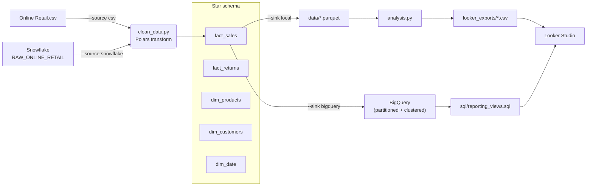

# Online Retail — Analytics Pipeline

An end-to-end analytics project on the [UCI Online Retail dataset](https://archive.ics.uci.edu/dataset/352/online+retail)
(~540k transactions from a UK-based online gift retailer, Dec 2010 – Dec 2011).
It cleans raw transactions into a **star schema** and then **answers business
questions** on top of it — revenue trends, top products, return rates, RFM
customer segmentation, and cohort retention.

It runs two ways:

- **Offline (default):** raw CSV → star schema → local parquet → analysis + Looker-ready CSVs. No cloud account needed.
- **Cloud:** Snowflake (raw) → star schema → BigQuery (partitioned/clustered) → Looker Studio reporting views.

## 🏗 Architecture



## 🚀 Quickstart (no credentials required)

```bash
python -m venv .venv && source .venv/bin/activate
pip install -r requirements.txt

python run_pipeline.py        # CSV -> star schema -> data/*.parquet
python analysis.py            # writes insights.md + looker_exports/*.csv
pytest                        # run the test suite
```

## ☁️ Cloud run

```bash
cp .env.example .env          # fill in Snowflake + BigQuery values
python load_snowflake.py                          # seed RAW_ONLINE_RETAIL (one-off)
python run_pipeline.py --source snowflake --sink bigquery
```

Authenticate to BigQuery with `gcloud auth application-default login`. Verify
connectivity with `python scripts/check_connections.py {snowflake|bigquery}`.

## 📊 Data model

A classic star schema with **surrogate keys** on every dimension, referenced by
the facts (`PRODUCT_KEY`, `CUSTOMER_KEY`, `DATE_KEY`):

| Type | Table | Grain | Notes |
| :--- | :--- | :--- | :--- |
| Fact | `fact_sales` | one sold line item | `TOTAL_PRICE = QUANTITY × UNITPRICE` |
| Fact | `fact_returns` | one returned line item | invoices starting `C` or negative quantity |
| Dim | `dim_products` | one row per `STOCKCODE` | canonical description |
| Dim | `dim_customers` | one row per `CUSTOMERID` | incl. guest bucket (`-1`) |
| Dim | `dim_date` | one row per calendar day | **continuous** range, with quarter/weekday/weekend |

## 🧼 Data-quality decisions

The raw data has well-known quirks; each is handled explicitly (and tested):

- **Missing CustomerID (~135k rows)** are **bucketed to a guest customer (`-1`)**, not dropped, so revenue reconciles. (Dropping them silently loses ~£1.5M of sales.)
- **Dimension grain is enforced.** 650 stock codes carry multiple descriptions and a few customers appear under several countries; dimensions collapse to one row per natural key using the most-frequent value.
- **Service / adjustment lines** (`POST`, `DOT`, `M`, `AMAZONFEE`, `BANK CHARGES`, gift cards, …) are excluded from product facts via the pattern `^\d{5}[A-Za-z]?$`.
- **Unparseable dates** are counted and logged rather than silently nulled.
- **Exact-duplicate rows** are dropped by default (logged), and `--keep-duplicates` makes the choice explicit and reversible.

## 📈 Analytics

`sql/` holds BigQuery Standard SQL for the warehouse; `analysis.py` computes the
same metrics locally and writes [`insights.md`](insights.md). Both cover:

- Revenue by month and by country, top products, average order value
- Return rate by product (`sql/return_rate.sql`)
- **RFM segmentation** — Champions / Loyal / At Risk / Hibernating … (`sql/rfm_segmentation.sql`)
- **Cohort retention** — monthly acquisition cohorts × months-since-first-order (`sql/cohort_retention.sql`)

**Selected findings** (full report in `insights.md`):

- Gross revenue **£10.2M** across **19.8k** orders; AOV **£517**; return rate **4.6%** by value.
- Revenue is **~85% UK** — heavy geographic concentration.
- Sales peak in the **pre-Christmas run-up** (Nov 2011 ≈ £1.45M vs a £0.79M monthly average).
- **Champions** (~800 customers) drive over half of all customer-attributed revenue.

## 📊 Looker Studio dashboard

**[▶ View the live dashboard](https://datastudio.google.com/reporting/ec4c8755-2932-417a-be4d-14d03c93b6a6)** — revenue scorecards, RFM segments, and the cohort-retention heatmap over the full dataset.

The reporting layer is shaped for Looker Studio so every chart reads from a
single source (no blending). Connect either way:

- **CSV upload (no cloud):** `python analysis.py` writes four files to `looker_exports/` — upload each as a *File Upload* data source.
- **BigQuery (cloud):** run `sql/reporting_views.sql` to create the `vw_*` views, then add each as a *BigQuery* data source.

| Source (`looker_exports/` CSV · BigQuery view) | Powers |
| :--- | :--- |
| `sales_obt` · `vw_sales_obt` | revenue scorecards, monthly trend, country geo map, top products |
| `product_performance` · `vw_product_performance` | return-rate table, units sold vs returned |
| `rfm_customers` · `vw_rfm_customers` | segment bar/pie, RFM scatter, revenue per segment |
| `cohort_retention` · `vw_cohort_retention` | retention pivot/heatmap (cohort × month offset) |

## 📂 Project structure

```
run_pipeline.py        ETL orchestrator (CLI: --source / --sink)
config.py              env loading + validation, logging, shared constants
snowflake_client.py    Snowflake extract (Arrow transport)
local_io.py            CSV source + local parquet sink
clean_data.py          pure Polars transform -> star schema
load_bigquery.py       BigQuery load (partitioning + clustering)
load_snowflake.py      one-off CSV -> Snowflake ingestion
analysis.py            KPIs, RFM, cohort -> insights.md + looker_exports/*.csv
sql/                   BigQuery analytical queries + Looker reporting views
looker_exports/        generated Looker-Studio-ready CSVs (gitignored)
tests/                 pytest unit tests for the transform
scripts/               manual connectivity checks
.github/workflows/     CI: ruff + pytest
```

## ✅ Testing & CI

The transform is a pure function, so the test suite runs with no credentials.
GitHub Actions runs `ruff check` and `pytest` on every push.

```bash
ruff check .
pytest
```
